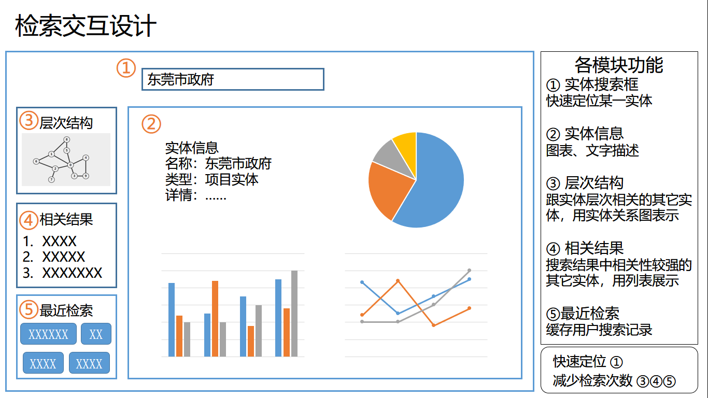

#  [实体检索前端Demo]更改需求

## 0.需求清单

1. 单页面解构
   1. 实体详情
   2. 实体关联
   3. 实体检索
   4. 图片服务
2. 简化代码（建议先阅读）
   * 尽可能简化代码逻辑
   * 删掉多余代码、注释、测试数据

## 1.单页面解构

每个页面都是独立的部分，各自功能独立。~~如果组件之间需要通信，可以使用 `Vue component` 的 `prop` 特性。~~为维持代码设计的简单性，组件之间相互独立，跳转时无需传递参数。

|   页面   | 组件          |
| :------: | ------------- |
| 实体详情 | EntityDetail  |
| 实体关联 | EntityNetwork |
| 实体检索 | EntitySearch  |
| 图片服务 | ImageView     |

### 1.1.实体详情

1. 搜索框：是该页面特有的，不要和其它页面共享（即从 `App.vue` 中迁移到 `EntityDetail.vue` ）

2. 添加 `ScollView` ，拓展页面下拉空间
3. **实体信息**的详情字段单独一行（测试数据：`华工图书馆` ）
4. **搜索缓存**独立开来，用 `vuex` 作全局缓存，在**[最近检索]**模块中呈现
5. 当用户选中实体后，将剩下的9个检索建议更新到**[相关结果]**模块中

在该页面中，需要 [Vuex.Store](https://vuex.vuejs.org/zh/guide/) 全局缓存的变量有

* `selectedEntity`  (或 `selectedUUID` ) 选中实体
* `entityHistory` 检索历史

页面效果如下所示：

### 1.2.实体关联

1. 添加特定的搜索框，效果和**[实体详情]**中的搜索框一样即可。
2. 在两个下拉框旁边添加文本域（ `label` ），写明“节点上限”、“最大深度”

3. 在合适的位置加个 `label` 指明当前实体的全称（ `FQDN`  ）

### 1.3. 实体检索

1. 把 `EntitySearch.vue` 添加进路由和侧边栏即可

### 1.4. 图片服务

- [] 需求待完善

## 2.代码简化

以下是代码需要简化的文件：

* EntityDetail.vue
* EntityNetwork.vue
* EntitySearch.vue
* ImageView.vue
* App.vue
* Router.js
* Main.js
* RestAPI.js（绿佳同学会尽快更新）

### 2.1.尽可能简化代码逻辑

由于Demo需要作为实训点的功能展示、代码开源，同时交接给企业人员，所以还请尽量做到：

* 代码逻辑简单
* 变量命名规范
* 添加一些必要注释

> 会在实训点中注明代码作者，毕竟这里面有着培文大佬的许多贡献~

### 2.2.消除冗余信息

* 多余代码（比如没有用到的函数）
* 测试数据
* 意义不大的注释